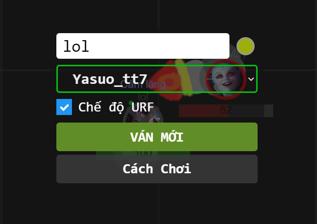
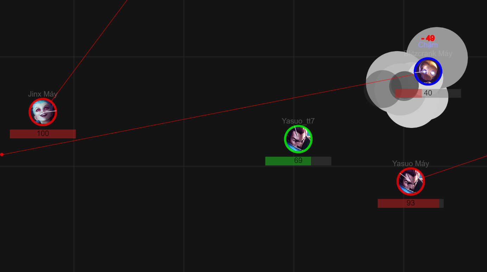

# [DEPRECATED] LOL2D - version 1

- Repo này đã làm **từ lâu** và **lỗi thời** :relieved: :grin:
- Sẽ không được tiếp tục phát triển 
- Những kinh nghiệm rút ra được từ repo này đang được áp dụng để **phát triển  Repo mới** [link github](https://github.com/LOL2D/LOL2D_core)  :yum: :heart_eyes:

Hãy follow mình và watch [repo](https://github.com/LOL2D/LOL2D_core) để có thể cập nhật được những feature mới nhất nhé :heartpulse: :star: :boom:

## GamePlay của trò chơi: [GamePlay](https://www.youtube.com/watch?v=yXC97XTBN7I)

## How to play

Cách chơi tiếng việt có trong menu game

- Click mouse to control, move characters

- Hold Q W E R on keyboard to Aim

- Release Q W E R to use Abilities

### Menu

### Game Play

